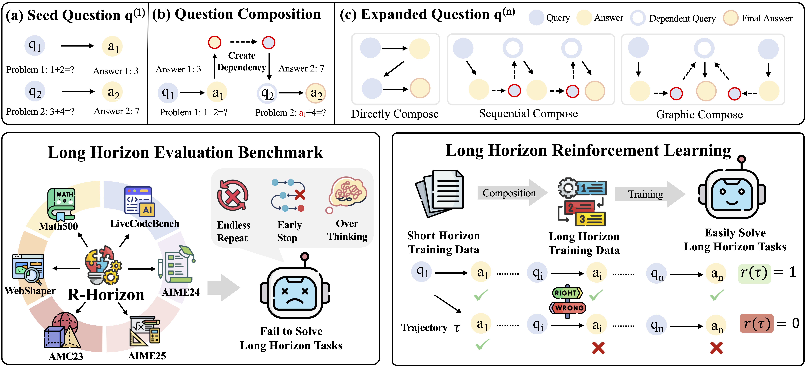

<div align="center">

# R-HORIZON

<div>
   🚀 How Far Can Your <strong>L</strong>arge <strong>R</strong>easoning <strong>M</strong>odel Really Go in Breadth and Depth? 
</div>
</div>

<br>


<p align="center">
  📃 <a href="TBD" target="_blank">Paper</a >  • 🤗 <a href="TBD" target="_blank">Dataset</a > 
</p >

R-HORIZON is a novel method designed to stimulate long-horizon reasoning behaviors in Large Reasoning Models (LRMs) through query composition. We transform isolated problems into complex multi-step reasoning scenarios, revealing that even the most advanced LRMs suffer significant performance degradation when facing interdependent problems that span long reasoning horizons.


## 🔥 Releases

**[2025-09-24]**
- 🎉 **R-HORIZON Benchmark** is now available! Test your LRMs on complex multi-horizon reasoning tasks.
- 🤗 **Training and evaluation datasets** are available on Hugging Face: [R-HORIZON Dataset](TBD)
- 📄 **Paper released** on arXiv: [R-HORIZON: How Far Can Your Large Reasoning Model Really Go in Breadth and Depth?](TBD)


## 🌟 Overview

Recent advances in reasoning-focused language models (e.g., OpenAI o1, DeepSeek-R1) have demonstrated remarkable improvements through test-time scaling and long Chain-of-Thought (CoT). However, existing benchmarks primarily focus on immediate, single-horizon tasks, failing to adequately evaluate models' ability to handle complex, long-horizon scenarios.

**Key challenges in current paradigms:**
- **Limited evaluation scope**: Existing benchmarks confine themselves to isolated problems, missing the complexity of real-world multi-step reasoning
- **Limited effective reasoning length**: Models struggle to maintain performance as reasoning chains grow longer
- **Poor thinking budget allocation**: LRMs fail to appropriately distribute thinking resources across multiple interdependent problems

To address these limitations, we introduce **R-HORIZON**, which:
- Transforms isolated problems into **complex multi-step reasoning scenarios** through query composition
- Establishes the **R-HORIZON Benchmark** comprising 6 representative datasets from mathematics, code generation, and agent applications
- Enables **reinforcement learning with verified rewards (RLVR)** using long-horizon reasoning data



## 📖 Table of Contents

- [R-HORIZON](#r-horizon)
  * [🔥 Releases](#-releases)
  * [🌟 Overview](#-overview)
  * [📊 R-HORIZON Benchmark](#-r-horizon-benchmark)
  * [🚀 Training with R-HORIZON](#-training-with-r-horizon)
  * [Quick Start](#quick-start)
    + [Installation](#installation)
    + [Benchmark Evaluation](#benchmark-evaluation)
    + [Training with RLVR](#training-with-rlvr)
  * [Dataset](#dataset)
  * [Citation](#citation)

## 📊 R-HORIZON Benchmark

We evaluate 20+ state-of-the-art LRMs on the R-HORIZON Benchmark, revealing significant performance degradation as reasoning horizons increase:


**Key findings from our benchmark evaluation:**

- **Universal performance degradation**: Even the most powerful models suffer severe drops as problem count increases. For instance, DeepSeek-R1 drops from 87.3% (single problem) to 24.6% (5 problems) on AIME25.

- **Model size matters**: Larger models exhibit more resilience to multi-horizon challenges. R1-Qwen-7B drops from 93.6% to 0% when solving 16 problems, showing 34.1% more degradation than the 32B variant.

- **Task-dependent degradation**: Code generation tasks show steeper performance declines compared to mathematics. Many reasoning models lose their tool-calling abilities in web search scenarios, resulting in poor multi-step performance.

## 🚀 Training with R-HORIZON

Training with R-HORIZON composed data yields substantial improvements on both single and multi-horizon reasoning tasks:


**Training results highlights:**

- **Dual Performance Gains**: Training with 2-composed problems significantly improves both multi-horizon reasoning (+17.4 points on AIME24 n=2) and single-problem performance (+7.5 points on AIME24 original).

- **Scalable Complexity**: Increasing composition complexity (n=4) enhances the model's ability to handle problems requiring more reasoning steps, achieving 50.6% on Math500 (n=8).

| Models | MATH500 (Origin) | MATH500 (n=8) | AIME24 (Origin) | AIME24 (n=2) | AIME25 (Origin) | AIME25 (n=2) | AMC23 (Origin) | AMC23 (n=2) |
|-----------------|------------------|---------------|-----------------|--------------|-----------------|--------------|----------------|-------------|
| R1-Qwen-7B | 93.6 | 11.8 | 48.3 | 16.4 | 33.3 | 3.5 | 90.2 | 48.8 |
| Baseline (n=1) | 95.6 | 8.4 | 57.9 | 16.7 | 47.9 | 5.1 | **95.9** | 55.0 |
| R-HORIZON (n=2) | 95.4 | 21.4 | **65.4** | 34.1 | **49.6** | 10.0 | 94.1 | 80.6 |
| R-HORIZON (n=4) | 94.6 | **50.6** | 62.9 | 34.8 | 45.4 | 8.1 | 91.9 | 79.1 |
| R-HORIZON (mixed) | **96.8** | 47.8 | 57.1 | 32.8 | 44.2 | 10.0 | 93.1 | 81.6 |
| R-HORIZON w/ R_all | 95.0 | 26.8 | 64.6 | **38.8** | 48.8 | **11.9** | 95.0 | **83.4** |

**Key Findings:**
- Models trained with n=2 composed problems achieve optimal performance on AIME tasks
- As composition complexity increases (n=4), models show stronger capabilities for handling problems requiring more reasoning steps
- Using R_all reward function (providing feedback on all intermediate answers) outperforms R_last (final answer only) for multi-problem scenarios
- Training with composed data benefits both single and multi-horizon reasoning, suggesting a positive transfer effect


## Quick Start

### Installation

```bash
# Clone the repository
git clone https://github.com/yourusername/R-HORIZON.git
cd R-HORIZON

# Create conda environment
conda create -n r-horizon python=3.10 -y
conda activate r-horizon

# Install PyTorch (adjust CUDA version as needed)
pip install torch==2.4.0 --index-url https://download.pytorch.org/whl/cu124

# Install additional dependencies
pip install -r requirements.txt
```

### Benchmark Evaluation (TODO: linsen)
1. Download the R-HORIZON Benchmark

```bash
# Download benchmark datasets
python scripts/download_benchmark.py --dataset all
# Or download specific datasets
python scripts/download_benchmark.py --dataset MATH500,AIME24,AIME25
```

2. Evaluate your model 

```python

```

### Training with RLVR (TODO: luyi)

```bash
# Generate composed training data

```


2. Launch training

```bash
# Train with R-HORIZON using GRPO algorithm
python train.py \
    --config config/train_config.yaml \
    --algorithm grpo \
    --dataset r_horizon_math \
    --num_problems 2 \
    --reward_scheme r_all \
    --model_name_or_path r1-qwen-7b \
    --output_dir ./checkpoints \
    --num_train_epochs 3 \
    --per_device_train_batch_size 4 \
    --gradient_accumulation_steps 8 \
    --learning_rate 5e-6 \
    --warmup_steps 100
```


# Dataset
The R-HORIZON datasets and benchmarks are available on Hugging Face Hub:


Dataset Structure

```json
{
  "id": "TBD",
  "problems": [
    {
      "problem_id": "TBD",
      "question": "TBD",
      "original_answer": "TBD",
      "modified_parameters": "TBD"
    }
  ],
  "dependencies": "TBD",
  "composition_method": "TBD",
  "expected_reasoning_steps": "TBD"
}
```

# Citation
If you find R-HORIZON helpful for your research, please cite our paper.
